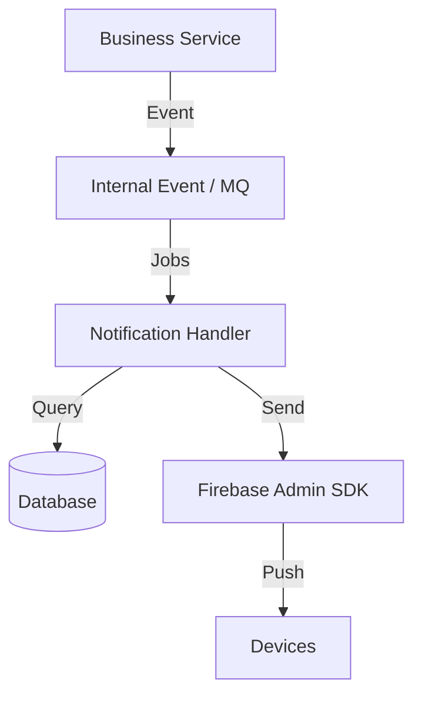

# 🏗️ Backend Implementation Guide: Push Notification System

Dịch vụ thông báo (Notification Service) là một thành phần quan trọng trong kiến trúc Microservice/Monolith để tương tác với người dùng. Tài liệu này đặc tả các bước triển khai chi tiết cho phía Backend.

---

## 1. KIẾN TRÚC HỆ THỐNG (SYSTEM ARCHITECTURE)

Hệ thống được thiết kế theo mô hình **Event-driven** và **Asynchronous Processing**.

- **Business Service**: Trigger thông báo khi có sự thay đổi dữ liệu (ví dụ: Lịch bảo vệ được chốt).
- **Internal Event / MQ**: 
  - *Microservices*: Dùng RabbitMQ/Kafka.
  - *Monolith*: Dùng Spring Events (`@EventListener`) kết hợp với `@Async`.
- **Notification Handler**: Component chịu trách nhiệm xử lý logic gửi push.

---

## 2. THIẾT KẾ CƠ SỞ DỮ LIỆU (DATABASE SCHEMA)

Cần có 2 bảng chính để quản lý thiết bị và lịch sử.

### 2.1. Bảng `device_tokens`
Quản lý các thiết bị đã đăng ký của người dùng.

| Field | Type | Description |
|-------|------|-------------|
| [id](file:///C:/Users/ASUS/.gemini/antigravity/installation_id) | UUID/Long | Primary Key |
| `user_id` | Long | Foreign Key tới bảng User |
| `device_token` | String | Token duy nhất từ FCM (Unique Index) |
| `platform` | Enum | `ANDROID`, `IOS` |
| `last_active` | Datetime | Cập nhật mỗi khi device tương tác với API |

### 2.2. Bảng `notifications` (Lịch sử)
Theo dõi các thông báo đã gửi để phục vụ hiển thị "Notification Center" trong app.

| Field | Type | Description |
|-------|------|-------------|
| [id](file:///C:/Users/ASUS/.gemini/antigravity/installation_id) | UUID/Long | Primary Key |
| `user_id` | Long | Người nhận |
| `title` | String | Tiêu đề thông báo |
| `body` | Text | Nội dung chi tiết |
| `data_payload` | JSONB/Text | Dữ liệu đính kèm (screen_id, object_id) |
| `status` | Enum | `SENT`, `FAILED`, `READ` |
| `created_at` | Datetime | Thời gian tạo |

---

## 3. CÁC API CẦN TRIỂN KHAI

### 3.1. Register Token (`POST /api/v1/devices/register`)
- **Input**: `{ "deviceToken": "...", "platform": "ANDROID/IOS" }`
- **Logic**:
  - `UPSERT` vào bảng `device_tokens`.
  - Nếu token này đã tồn tại cho user khác -> Chuyển quyền sở hữu token sang user hiện tại (trường hợp dùng chung máy).

### 3.2. Unregister Token (`DELETE /api/v1/devices/token/{token}`)
- **Logic**: Xóa token khỏi DB khi user chủ động logout.

---

## 4. QUY TRÌNH XỬ LÝ GỬI THÔNG BÁO (THE WORKER LOGIC)

1.  **Consume Job**: Lấy `userId`, `title`, `body`, `payload` từ Queue.
2.  **Fetch Tokens**: Truy vấn tất cả `device_token` hoạt động của `userId`.
3.  **Construct Message**: Tạo đối tượng `Message` của Firebase Admin SDK.
    - `notification`: Cho OS hiển thị banner.
    - [data](file:///d:/Mobile/app/.metadata): Cho App xử lý logic bên dưới.
4.  **Send & Handle Results**:
    - Sử dụng `FirebaseMessaging.getInstance().sendMulticast(message)`.
    - **Quan trọng**: Nếu kết quả trả về báo lỗi `MessagingErrorCode.UNREGISTERED` hoặc `INVALID_ARGUMENT`, Backend **PHẢI** xóa token đó khỏi DB ngay lập tức để tránh lãng phí tài nguyên ở lần gửi sau.

---

## 5. CÁC LƯU Ý CHO SENIOR BACKEND
- **Rate Limiting**: Tránh gửi quá nhiều push trong thời gian ngắn cho 1 user (Spam protection).
- **Security**: Không gửi thông tin nhạy cảm vào `payload`. Chỉ gửi IDs.
- **Batching**: Tận dụng tính năng gửi Cluster/Multicast của FCM để tối ưu hiệu năng mạng.

---

## 6. ĐẶC THÙ CHO KIẾN TRÚC MONOLITH

Nếu hệ thống của anh là **Monolith**, anh không nhất thiết phải cài đặt RabbitMQ/Kafka ngay lập tức. Anh có thể tận dụng các cơ chế nội tại của Spring Boot:

### 6.1. Spring Events (`ApplicationEventPublisher`)
- Khi có sự kiện: `publisher.publishEvent(new NotificationEvent(this, data))`.
- Điều này giúp tách biệt logic nghiệp vụ khỏi logic gửi push ngay trong cùng một project.

### 6.2. Xử lý Bất đồng bộ (`@Async`)
- Đánh dấu method gửi push là `@Async`.
- **Lưu ý**: Phải cấu hình `ThreadPoolTaskExecutor` riêng để tránh việc gửi push chiếm sạch thread của ứng dụng chính.

### 6.3. Giả lập Queue bằng Database
- Nếu muốn retry bền vững hơn mà không dùng MQ:
  - Lưu thông báo vào bảng `notifications` với trạng thái `PENDING`.
  - Dùng một `@Scheduled` task quét bảng này mỗi phút để gửi những thông báo chưa gửi thành công.
